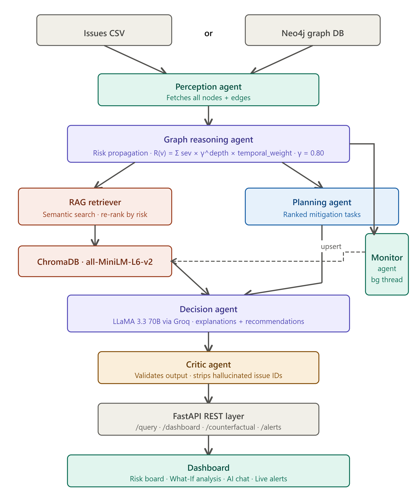

<div align="center">

# 🔥 RiskTrace Engine

### *Proactive Risk Intelligence for Software Projects*

[](https://python.org)
[](https://fastapi.tiangolo.com)
[](https://trychroma.com)
[](https://console.groq.com)
[](LICENSE)

**RiskTrace Engine** ingests issue-tracker data, builds a live temporal dependency graph, and continuously propagates risk scores from delayed or blocked tasks downstream — surfacing cascades *before* they become critical.

[Features](#-features) • [Architecture](#-architecture) • [Quickstart](#-quickstart) • [API](#-api-reference) • [What-If Analysis](#-what-if-counterfactual-analysis) • [RAG](#-semantic-rag-retrieval)

---

</div>

## ✨ Features

| | Feature | Description |
|---|---|---|
| 🕸️ | **Temporal Dependency Graph** | Builds a directed risk graph from JIRA-style CSVs or Neo4j — 300 synthetic issues, 12,700+ real Hadoop issues supported |
| 📉 | **Multi-hop Risk Propagation** | Risk decays with graph distance (γ = 0.8/hop) and issue staleness — every node gets a principled score in [0, 1] |
| 🔮 | **Counterfactual What-If** | Hypothetically resolve any issue and instantly see cascading before/after risk diffs — zero DB writes |
| 🤖 | **6-Agent Pipeline** | Perception → Graph Reasoning → Planning → Decision (LLM) → Monitoring → Critic |
| 🔍 | **Semantic RAG Retrieval** | ChromaDB + `all-MiniLM-L6-v2` embeddings replace keyword matching — "tasks behind schedule" correctly matches "overdue", "blocked", "delayed" |
| 🧠 | **LLM Explanations** | Groq LLaMA 3.3 70B generates root cause summaries and prioritised action plans |
| 📡 | **Live Monitoring** | Background agent polls for state changes and upserts the vector index — retrieval always reflects current graph state |
| 🖥️ | **Zero-build Dashboard** | Single HTML file — open directly in browser, no npm or build step |
| 🔀 | **Dual Backend** | CSV mode (no database needed) or Neo4j mode — switch with one env variable |

---

## 🏗️ Architecture

```
┌─────────────────────────────────────────────────────────────────┐
│                        RiskTrace Engine                          │
│                                                                   │
│  Issues CSV / Neo4j                                              │
│         │                                                         │
│         ▼                                                         │
│  ┌─────────────────┐     fetches nodes + edges                   │
│  │ PerceptionAgent │────────────────────────────────┐            │
│  └─────────────────┘                                │            │
│         │                                           │            │
│         ▼                                           ▼            │
│  ┌──────────────────────┐          ┌────────────────────────┐   │
│  │ GraphReasoningAgent  │          │   MonitoringAgent      │   │
│  │  RiskPropagationEngine│         │  (background thread)   │   │
│  │  R(v) = Σ γ^d × sev │          │  detects state changes │   │
│  └──────────────────────┘          └────────────────────────┘   │
│         │                                     │                  │
│    ┌────┴──────────┐                          │ upsert           │
│    │               │                          ▼                  │
│    ▼               ▼               ┌──────────────────────┐     │
│  PlanningAgent  RAGRetriever       │  ChromaDB Vector DB  │     │
│  (mitigation)   (semantic search)  │  all-MiniLM-L6-v2    │     │
│    │               │               └──────────────────────┘     │
│    └───────┬───────┘                                             │
│            ▼                                                      │
│    ┌───────────────┐     LLaMA 3.3 70B via Groq                 │
│    │ DecisionAgent │────────────────────────────                 │
│    └───────────────┘                                             │
│            │                                                      │
│            ▼                                                      │
│    ┌───────────────┐     validates hallucinations                │
│    │  CriticAgent  │     strips invalid issue IDs               │
│    └───────────────┘                                             │
│            │                                                      │
│            ▼                                                      │
│       FastAPI REST  →  issuegraph_ui.html                        │
└─────────────────────────────────────────────────────────────────┘


```

### Risk Score Formula

```
R(v) = Σ [ delay_severity(u) × γ^(depth−1) × temporal_weight(u) ]
       for each upstream risky ancestor u at depth d

delay_severity(u) = min(delay_days / 30, 1.0)    ← delayed nodes
                  = 1.0                            ← blocked nodes
γ  (depth decay)  = 0.80 per hop
temporal_weight   = 0.5 + 0.5 × e^(−age_days / 30)
```

---

## 📁 Project Structure

```
RiskTrace-Engine/
│
├── agents.py              ← All 6 agents + RAGRetriever + AgentPipeline orchestrator
├── main.py                ← FastAPI app — all REST endpoints
├── risk_engine.py         ← Core propagation algorithm (DB-agnostic)
├── csv_db.py              ← In-memory CSV graph DB (Neo4j drop-in replacement)
├── build_graph.py         ← Neo4j graph loader
├── preprocess.py          ← Synthetic data generator
├── predictive_model.py    ← ML-based risk prediction
├── predictive_analysis.py ← Predictive analysis utilities
├── evaluate.py            ← Evaluation & benchmarking
├── issuegraph_ui.html     ← Single-file dashboard (no build step)
├── requirements.txt       ← Python dependencies
│
└── data/
    ├── processed/         ← 300 synthetic issues, 124 dependencies
    └── real_hadoop/       ← 12,740 real Apache Hadoop JIRA issues
```

---

## 🚀 Quickstart

### Mode A — CSV (No Database Required) ✅ Recommended

**1. Clone and install**
```bash
git clone https://github.com/YOUR_USERNAME/RiskTrace-Engine.git
cd RiskTrace-Engine
pip install -r requirements.txt
```

**2. Create `.env`**
```env
USE_NEO4J=false
MONITOR_INTERVAL=60

# Optional — enables LLM explanations and AI chat
# GROQ_API_KEY=your_groq_key_here
```

**3. Generate synthetic data**
```bash
python preprocess.py --synthetic
```

**4. Start the server**
```bash
uvicorn main:app --reload --port 8000
```

```
✓ Running in CSV mode
RAGRetriever initialised with model 'all-MiniLM-L6-v2'
RAGRetriever: indexed 300 issues
IssueGraphAgent++ ready  [mode: csv]
```

**5. Open the dashboard**

Open `issuegraph_ui.html` in your browser and enter `http://localhost:8000` when prompted.

---

### Mode B — Neo4j

**1. Install [Neo4j Desktop](https://neo4j.com/download)** → Create a project → Start a database → Note your password

**2. Create `.env`**
```env
USE_NEO4J=true
NEO4J_URI=bolt://localhost:7687
NEO4J_USER=neo4j
NEO4J_PASSWORD=your_password_here
MONITOR_INTERVAL=60

# GROQ_API_KEY=your_groq_key_here
```

**3. Load data into Neo4j**
```bash
python preprocess.py --synthetic
python build_graph.py
```

**4. Start the server**
```bash
uvicorn main:app --reload --port 8000
```

> If Neo4j is unreachable at startup, the server automatically falls back to CSV mode — it will never crash due to a DB connection issue.

---

## 📡 API Reference

| Method | Endpoint | Description |
|--------|----------|-------------|
| `GET` | `/health` | Server status and active backend mode |
| `GET` | `/dashboard` | Full risk dashboard — top risks, action plan, alerts |
| `GET` | `/risk/{issue_id}` | Risk score + explanation for a single issue |
| `GET` | `/graph/{issue_id}` | Dependency chain as nodes + edges |
| `GET` | `/alerts` | Proactive monitoring alerts from background watcher |
| `POST` | `/query` | Natural language query to the AI agent pipeline |
| `POST` | `/counterfactual/{issue_id}` | **What-If simulation** — before/after risk diff |
| `GET` | `/predictive-analysis` | ML-based risk prediction across the graph |
| `POST` | `/train-predictive-model` | (Re)train the predictive model on current data |
| `GET` | `/predictive-model-info` | Model metadata and feature importances |

Interactive Swagger docs: **[http://localhost:8000/docs](http://localhost:8000/docs)**

### Example: Query the AI agent
```bash
curl -X POST http://localhost:8000/query \
  -H "Content-Type: application/json" \
  -d '{"query": "which blocked tasks are causing the most downstream risk?"}'
```

### Example: What-If simulation
```bash
curl -X POST http://localhost:8000/counterfactual/HADOOP-121 \
  -H "Content-Type: application/json" \
  -d '{"resolve_as": "Done"}'
```

```json
{
  "impact_summary": {
    "nodes_improved": 7,
    "high_risk_reduction": 3,
    "estimated_delay_days_saved": 42
  },
  "diff": [
    { "issue_id": "KAFKA-23", "before": 0.87, "after": 0.21, "delta": -0.66 },
    { "issue_id": "SPARK-34", "before": 0.74, "after": 0.18, "delta": -0.56 }
  ]
}
```

---

## 🔮 What-If Counterfactual Analysis

This is the **novel research contribution** of the project.

Open the dashboard → click **What-If** in the sidebar → enter any issue ID → click **Run Simulation**.

**What happens under the hood:**

1. The entire dependency graph is cloned in memory — zero database writes
2. The selected issue is marked as `Done` (delay = 0)
3. The full temporal risk propagation algorithm reruns on the clone
4. A side-by-side graph diff is returned: colour-coded BEFORE / AFTER nodes
5. Impact cards show: nodes improved, high-risk reductions, total delay-days saved

**Why it matters:** Counterfactual reasoning has not previously been applied to software project dependency graphs. The simulation uses the same temporal decay formula as the live engine, making estimates principled rather than heuristic — formally equivalent to interventional reasoning in causal inference.

**Good issues to try:**

| Issue ID | Why it's interesting |
|----------|---------------------|
| `HADOOP-121` | Direct blocker of the KAFKA-23 chain |
| `HADOOP-16` | Cascades into 7+ high-risk downstream nodes |
| `KAFKA-33` | Feeds SPARK-34 → SPARK-35 → HADOOP-36 |
| `KAFKA-23` | High-centrality node affecting a large graph portion |

---

## 🔍 Semantic RAG Retrieval

The `get_relevant_context()` method uses **real vector-based retrieval** — not keyword matching.

### How it works

Each issue is embedded as a rich document string:
```
HADOOP-121: MapReduce job is overdue and blocking release.
Status: Blocked. Priority: Critical.
This issue is overdue and behind schedule by 14 days. It is delayed and late.
This issue is blocked and cannot proceed. It is a blocker.
Risk score: 0.87 (High risk).
```

At query time, the query is embedded using the same model and cosine similarity retrieves the top-k semantically closest issues.

### Query-aware re-ranking

For risk-oriented queries, retrieval uses a hybrid score:

```
final_score = semantic_similarity × 0.7 + risk_boost × 0.3
```

For neutral queries, pure semantic similarity is used (risk boost = 0).

### Why this beats keyword matching

| Query | Keyword matching | Semantic RAG |
|-------|-----------------|--------------|
| `"tasks behind schedule"` | Only matches literal "behind" or "schedule" | ✅ Matches "overdue", "delayed", "late", "blocked" |
| `"blocked critical issues"` | Only matches "blocked" and "critical" | ✅ Surfaces Blocked+Critical issues by meaning |
| `"routine low priority tasks"` | May return nothing | ✅ Correctly surfaces Open+Low priority issues |

### Verified test results

```
✅ Test 1 — "tasks behind schedule"   → HADOOP-5, HADOOP-1, HADOOP-3  (all at-risk)
✅ Test 2 — "blocked critical issues" → HADOOP-5, HADOOP-1             (both Blocked)
✅ Test 3 — "routine low priority"    → HADOOP-2, HADOOP-4             (both low-risk)
```

---

## 🧪 Running the RAG Test

```bash
python test_rag.py
```

Expected output:
```
RAG available: True
--- Test 1: 'tasks behind schedule' ---
  #1: HADOOP-5 | at_risk=True | Deployment blocked, release deadline missed by 3 weeks
  #2: HADOOP-1 | at_risk=True | MapReduce job is overdue and blocking release
  #3: HADOOP-3 | at_risk=True | Unit tests failing on CI pipeline, build is late
PASS
--- Test 2: 'blocked critical issues' ---
  #1: HADOOP-5 | status=Blocked | ...
  #2: HADOOP-1 | status=Blocked | ...
PASS
--- Test 3: 'routine low priority tasks' ---
  #1: HADOOP-2 | priority=Low | Documentation update
PASS
```

---

## 🤖 The 6-Agent Pipeline

```
User Query
    │
    ▼
PerceptionAgent        — Ingests graph state (nodes + edges) from CSV or Neo4j
    │
    ▼
GraphReasoningAgent    — Runs temporal risk propagation; computes R(v) for all nodes
    │
    ▼
RAGRetriever           — Semantic vector search; filters context to top-k relevant issues
    │
    ▼
PlanningAgent          — Decomposes mitigation goal into ranked sub-tasks
    │
    ▼
DecisionAgent          — LLaMA 3.3 70B via Groq; generates explanation + recommendations
    │
    ▼
CriticAgent            — Validates LLM output; strips hallucinated issue IDs
    │
    ▼
Response
```

**MonitoringAgent** runs independently as a background thread, polling for state changes and emitting proactive alerts when risk spikes.

---

## ⚙️ Configuration

| Variable | Default | Description |
|----------|---------|-------------|
| `USE_NEO4J` | `false` | Set `true` to use Neo4j backend |
| `NEO4J_URI` | `bolt://localhost:7687` | Neo4j connection URI |
| `NEO4J_USER` | `neo4j` | Neo4j username |
| `NEO4J_PASSWORD` | *(required if Neo4j)* | Neo4j password |
| `GROQ_API_KEY` | *(optional)* | Enables LLM explanations and AI chat |
| `MONITOR_INTERVAL` | `60` | MonitoringAgent poll interval in seconds |

---

## 🧠 Tech Stack

| Layer | Technology |
|-------|-----------|
| API | FastAPI + Uvicorn |
| Graph DB | Neo4j 5 / in-memory CSV |
| Vector Store | ChromaDB (in-memory, cosine similarity) |
| Embeddings | `sentence-transformers/all-MiniLM-L6-v2` |
| LLM | Groq — LLaMA 3.3 70B |
| ML Prediction | scikit-learn |
| Frontend | Vanilla HTML/CSS/JS (zero build step) |
| Data | Apache Hadoop JIRA export (12,740 real issues) |

---

## 📊 Dataset

Two datasets are included:

**Synthetic** (`data/processed/`) — 300 issues, 124 dependencies. Generated by `preprocess.py`. Good for quick demos and development.

**Real Hadoop** (`data/real_hadoop/`) — 12,740 real Apache Hadoop JIRA issues with authentic dependency chains, priority distributions, and delay patterns. Switch to it by updating the data path in `.env`.

---

<div align="center">

Built as part of **IssueGraphAgent++** — a research project on proactive AI-driven software risk intelligence.

*Amrita Vishwa Vidyapeetham, School of Computing — Group 7*

</div>
